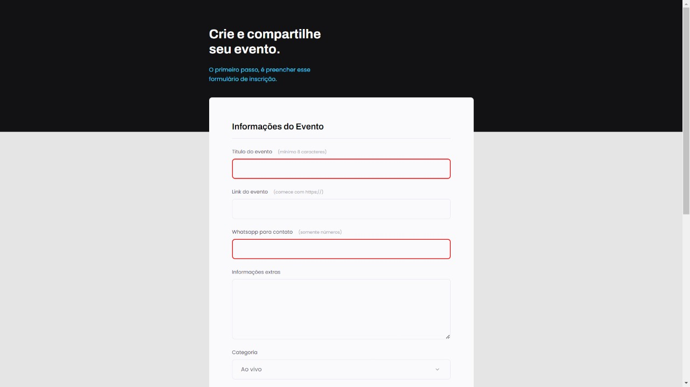

<h3 align="center"> Projeto 03 Explorer </h3>

## 🚀 Trilha Explorer

> Projeto desenvolvido durante o curso Explorer da Rocketseat!

[🔗Clique para acessar](https://treine-me-chi.vercel.app/)

##### 🛠 Tecnologias utilizadas

- HTML_
- CSS
- Git e Github

##### 💻 Contato
🛠 `Frontend` Developer Jr.  
&nbsp;&nbsp;&nbsp;&nbsp;

 

